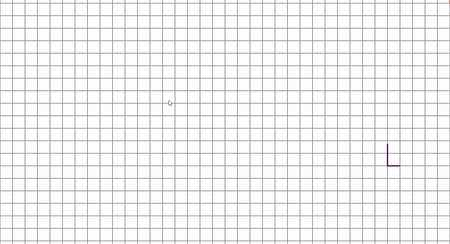

# grid-lines

Interactive canvas animation of lines moving on a grid next to the user cursor.

Original idea from Robert Coopercode - [Animated Grid Line](https://github.com/robertcoopercode/animated-grid-lines)